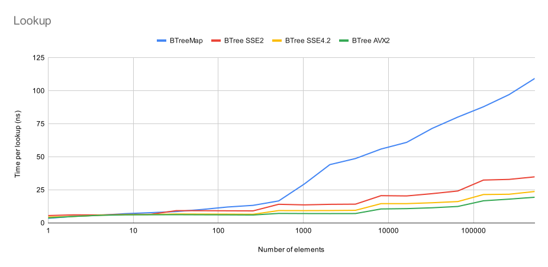
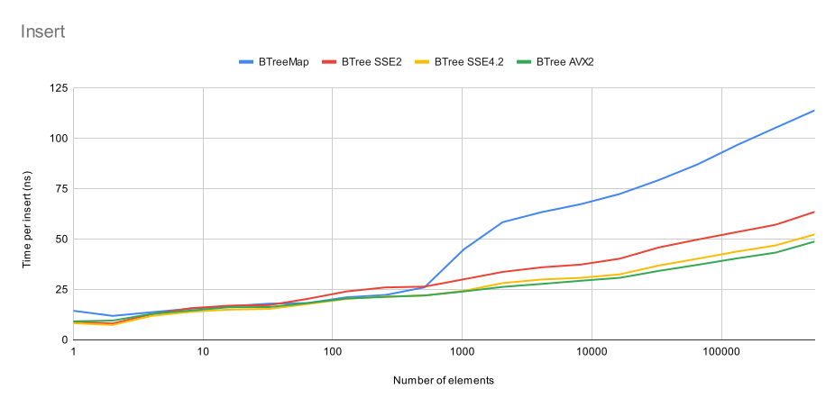

# brie-tree

A fast [B+ Tree] implementation that uses integer keys.

The API is similar to the standard library's [`BTreeMap`] with some significant
differences:
- Lookups and insertions are 2-4x faster than `BTreeMap`.
- `BTree` can optionally be used as a multi-map and hold duplicate keys.
- Keys must be integer types or convertible to integers via the `BTreeKey` trait.
- The maximum integer value is reserved for internal use and cannot be used
  by keys.
- Elements in the tree are ordered by the integer value of the key instead
  of the `Ord` implementation of the keys.
- Cursors can be used to seek back-and-forth in the tree while inserting or
  removing elements.
- Iterators only support forward iteration.

The data structure design is based on the [B- Tree] by Sergey Slotin, but has
been significantly extended.

[B+ Tree]: https://en.wikipedia.org/wiki/B%2B_tree
[`BTreeMap`]: https://doc.rust-lang.org/std/collections/struct.BTreeMap.html
[B- Tree]: https://en.algorithmica.org/hpc/data-structures/b-tree/

## Performance

Restricting keys to integer types is what allows this crate to be so much faster
than the standard library. Notably, this allows searching *within* B-Tree nodes
to be done using an efficient SIMD search.

Currently, SIMD optimizations are implemented for the following targets:

| SIMD instruction set   | Target feature flags to use             |
|------------------------|-----------------------------------------|
| x86 SSE2 (x86-64-v1)   | `+sse2` (enabled by default on x86-64)  |
| x86 SSE4.2 (x86-64-v2) | `+sse4.2,+popcnt`                       |
| x86 AVX2 (x86-64-v3)   | `+avx2,+popcnt`                         |
| x86 AVX512 (x86-64-v4) | `+avx512bw,+popcnt`                     |
| AArch64 NEON           | `+neon` (enabled by default on AArch64) |
| AArch64 SVE            | `+sve`                                  |
| RISC-V RVV             | `+v`                                    |

In the absence of any of these, there is a fallback implementation using an
unrolled binary search.

This crate doesn't use dynamic dispatch since the cost of dispatch would
outweigh the performance benefits of a faster implementation. Instead, the
target features must be enabled at compile-time by passing them to
`-C target-feature=`:

```sh
RUSTFLAGS="-C target-feature=+avx2,+popcnt" cargo build --release
```

## Benchmarks

These benchmarks compare the standard library's `BTreeMap` with this crate's
`BTree`. The benchmarks were run on a Ryzen 9 3950X system.





## License

Licensed under either of:

 * Apache License, Version 2.0, ([LICENSE-APACHE](LICENSE-APACHE) or https://www.apache.org/licenses/LICENSE-2.0)
 * MIT license ([LICENSE-MIT](LICENSE-MIT) or https://opensource.org/licenses/MIT)

at your option.

### Contribution

Unless you explicitly state otherwise, any contribution intentionally submitted
for inclusion in the work by you, as defined in the Apache-2.0 license, shall be dual licensed as above, without any
additional terms or conditions.
